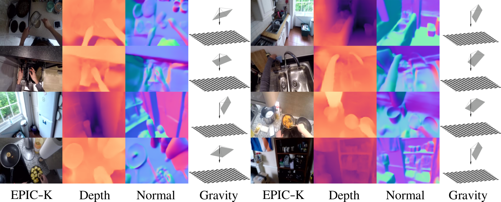

# Egocentric Scene Understanding via Multimodal Spatial Rectifier

This repository contains the source code for our paper:

**Egocentric Scene Understanding via Multimodal Spatial Rectifier**  
Tien Do, Khiem Vuong, and Hyun Soo Park  
IEEE/CVF Conference on Computer Vision and Pattern Recognition (CVPR), 2022  
[Project webpage](https://tien-d.github.io/egodepthnormal_cvpr22.html) 

[comment]: <> (| [Dataset]&#40;???&#41; | [arXiv]&#40;???&#41; )


<b>Figure: Qualitative results for depth, surface normal, and gravity 
prediction on EPIC-KITCHENS dataset.</b>

## Installation
:star2: Demo code and installation instructions will be available soon! :star2:

## Egocentric Depth on everyday INdoor Activities (EDINA) Dataset

**:star2: EDINA test set is now available to download! :star2:**

### Overview
EDINA is an egocentric dataset that comprises more than 500K synchronized RGBD frames and gravity directions. Each instance in the dataset is a triplet: RGB image, depths and surface normals, and 3D gravity direction.


**Please refer to [dataset](README_dataset.md) for more details, including downloading instructions and dataset organization.** 

## Citation
If you find our work to be useful in your research, please consider citing our paper:
```
@InProceedings{Do_2022_EgoSceneMSR,
    author     = {Do, Tien and Vuong, Khiem and Park, Hyun Soo},
    title      = {Egocentric Scene Understanding via Multimodal Spatial Rectifier},
    booktitle  = {Proceedings of the IEEE/CVF Conference on Computer Vision and Pattern Recognition (CVPR)},
    month      = {June},
    year       = {2022}
}
```

## Contact
If you have any questions/issues, please create an issue in this repo or contact us at [this email](doxxx104@umn.edu). 


